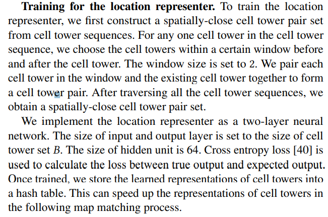
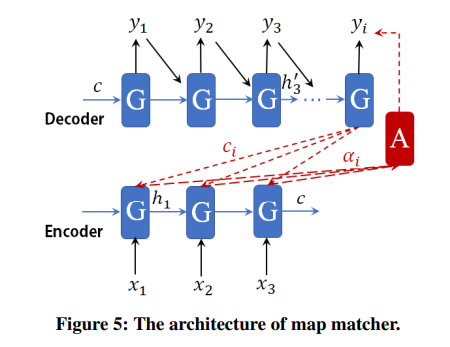

## DMM阅读笔记

### 预备知识

对于二分类器，有以下定义

* TP：true positive，真实结果为正，预测结果也为正

* FP：false positive，真实结果为负，预测结果却为正

* TN：true negative，真实结果为负，预测结果也为负

* FN：false negative，真实结果为正，预测结果却为负

* precision：精度，定义为
  $$
  P=\frac{TP}{TP+FP}
  $$

* recall：召回率，定义为
  $$
  recall=\frac{TP}{TP+FN}
  $$
  其中，$TP+FN$表示的是所有真实结果为正的样例。所以recall是描述了测试集中的真实正例有多少被二分类器挑选了出来，即真实的正例有多少被该二分类器召回。

  提高precision意味着提高检测门槛，一个样例更不容易被检测为正；而提高recall意味着要检测出更多的真实为正的样例，所以要降低检测门槛。因此，precision和recall往往是相互矛盾的，一个升高一个就会降低。

* RNN和LSTM：https://zhuanlan.zhihu.com/p/123211148

* interpolate：插值

* proximity：空间上的邻近性

* leverage：利用

* heuristic：启发式算法

* anonymized：匿名的

* CDF：Cumulative Distribution Function，累计分布函数，对连续函数，所有小于等于a的值，其出现概率的和。$F(a)=P(x<=a)$

* Towards this end：为了/旨在实现这个

* $\odot$：哈达玛积，表示两个矩阵对应元素相乘
  $$
  \begin{bmatrix}
  1 &2\\
  3 &4
  \end{bmatrix}
  \odot
  \begin{bmatrix}
  3 &4\\
  1 &2
  \end{bmatrix}
  =
  \begin{bmatrix}
  1\times3 &2\times4\\
  3\times1 &4\times2
  \end{bmatrix}
  =
  \begin{bmatrix}
  3 &8\\
  3 &8
  \end{bmatrix}
  $$
  

### DMM

#### Introduction

* 输入：a sequence of cell tower locations
* 输出：匹配到的路段
* DMM这篇论文是讲怎么用深度学习的方法来做地图匹配，也就是输入一些蜂窝数据点，然后输出匹配到的路段（takes a sequence of cell tower locations as input and infers a trajectory composed of road segments）
* encoder-decoder model：

  * 解决两个问题：
    * RNN的输出是独立的，即，两个相邻的输出路段之间并不一定是连续的
    * 一个基站塔可能会覆盖很多道路，输入到模型中的道路可能会很多，同时数量也是变化的。
  * 维护两个RNN
    * 一个用来将变长度的基站序列编码成固定长度的、有上下文信息的向量
    * 一个用于将第一个RNN编码出来的向量解码成变长度的基站序列
  * 加入alignment component

#### Overview

* Locatoin representer

  * 如何量化基站点？

    * 独热码

      缺点：冗余太多，影响训练效率；无法利用已经训练好的数据

    * GPS位置

      缺点：it is difficult to derive a high-quality representation of an input cell tower sequence from a sequence of two-dimensional coordinates.

  * 基本结构

     通过一个基本的自动编码器实现基站的编码。After many iterations, the location information of cell towers as well as spatial proximity among cell towers are learned and represented in the weight matrix of the representation layer.
     
     实际上这就是一个自编码器，但是，基础的自编码器并不能够反映空间邻近信息，因此，作者首先构建一个空间上邻近的基站集，实际上就是设置一个大小为2的窗口，对一个基站，只取前后窗口内的基站和当前基站分别构成两个基站对，然后将这两个基站对放到上面所说的基站集中（基站的序列是按什么规则排的还不是很清楚）。训练时，对于基站对$(A,B)$，$A$是输入，$B$是expected output，通过不断降低loss，来最大化预测出$B$的概率。那$Eq\ 1$到底是什么意思呢？实际上，因为预测出来的基站不一定就是窗口内的基站，所以对于基站$x$，在预测完这个点后，结果是他的窗口内的基站的概率总和并不一定是1！！。所以我们就要最大化预测出的基站在窗口内的概率，所以需要求和！！而这里的求和，是对$C_x$内的所有基站求和，$C_x$就是这个窗口！！！！
     
     
     
     看完这部分后豁然开朗！
  
* Map matcher

  * 结构：

    

  * Encoder-decoder

    